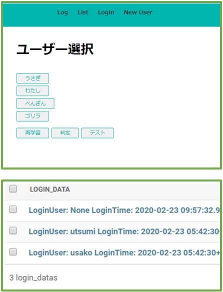

# inout_check
卒業研究で制作した、顔認証を使った在室管理システム。

- 顔検出:  
Haar-like特徴を使ったcascade分類器を使う手法を用いた。
- 顔認証  
Kerasを使用して 顔画像を100枚程度学習、少ない人数なら判別できる。
- 環境:  
RaspberryPiを使用。同じネットワークに接続することで，webからシステムを操作することができる。  
データベースはpostgreSQLを使用。
- UI:  
DjangoからWebから操作可能にし、簡単なUIを実装した。login画面になるとカメラが起動し、顔認証ができればログインとする流れになっている。

